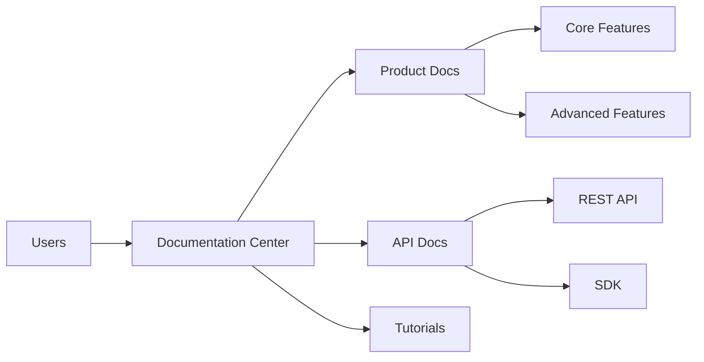

# Product Introduction

## Overview

YayuWiki is an enterprise-grade product documentation center that provides comprehensive technical documentation, API references, and best practice guides for users.

## Key Features

### 1. Comprehensive Documentation Coverage

- **Product Documentation** - Detailed product feature descriptions and user guides
- **API Documentation** - Complete API interface documentation with code examples
- **Best Practices** - Validated solutions and usage tips

### 2. Multi-language Support

Our documentation supports both Chinese and English to meet the needs of different users.

### 3. Modern Reading Experience

- Dark/Light theme switching
- Responsive design, perfectly adapted to all devices
- Powerful search functionality
- Code highlighting and copying

## Product Architecture

## Target Audience

- **Developers** - Technical personnel who need to integrate our products
- **Product Managers** - Understanding product features and planning
- **Technical Support** - Support teams solving user issues
- **End Users** - Enterprise users using the product

## Next Steps

Continue reading the [Installation Guide](installation.md) to learn how to quickly get started with our product.

