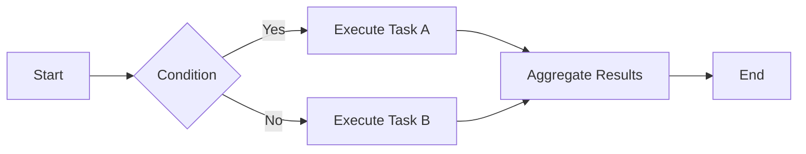

# Features

This page details the core features and capabilities of the product.

## Core Features

### 1. User Authentication & Authorization

#### Multiple Authentication Methods

- **Username/Password Login** - Traditional username and password authentication
- **OAuth 2.0** - Third-party login support (WeChat, DingTalk, etc.)
- **LDAP/AD** - Enterprise directory service integration
- **SAML 2.0** - Enterprise Single Sign-On

#### Permission Management

```python
# Example: Role-Based Access Control
@require_permission("user:read")
def get_user_list():
    """Get user list"""
    return User.query.all()

@require_permission("user:write")
def create_user(user_data):
    """Create user"""
    user = User(**user_data)
    db.session.add(user)
    db.session.commit()
    return user
```

### 2. Data Management

#### Data Import

Support for multiple data import formats:

- CSV
- Excel (XLSX)
- JSON
- XML

#### Data Export

```javascript
// Example: Export data to Excel
async function exportToExcel(data, filename) {
    const workbook = new ExcelJS.Workbook();
    const worksheet = workbook.addWorksheet('Data');
    
    // Add headers
    worksheet.columns = [
        { header: 'ID', key: 'id', width: 10 },
        { header: 'Name', key: 'name', width: 32 },
        { header: 'Email', key: 'email', width: 32 }
    ];
    
    // Add data
    worksheet.addRows(data);
    
    // Save file
    const buffer = await workbook.xlsx.writeBuffer();
    saveAs(new Blob([buffer]), filename);
}
```

### 3. Real-time Communication

#### WebSocket Support

```python
# Server-side example
from fastapi import WebSocket

@app.websocket("/ws")
async def websocket_endpoint(websocket: WebSocket):
    await websocket.accept()
    while True:
        data = await websocket.receive_text()
        await websocket.send_text(f"Message received: {data}")
```

```javascript
// Client-side example
const ws = new WebSocket('ws://localhost:8080/ws');

ws.onopen = () => {
    console.log('Connected to server');
    ws.send('Hello Server!');
};

ws.onmessage = (event) => {
    console.log('Received:', event.data);
};
```

### 4. Task Scheduling

Support for scheduled and asynchronous task processing:

```python
from celery import Celery

app = Celery('tasks', broker='redis://localhost:6379')

@app.task
def process_data(data_id):
    """Asynchronous data processing"""
    data = fetch_data(data_id)
    result = analyze_data(data)
    save_result(result)
    return result

# Scheduled task
@app.task
def daily_report():
    """Daily report generation"""
    generate_report()
```

### 5. Monitoring & Alerts

#### System Monitoring

- CPU usage
- Memory usage
- Disk I/O
- Network traffic

#### Business Monitoring

- API call statistics
- Error rate monitoring
- Response time analysis
- User behavior tracking

#### Alert Rules

!!! warning "Alert Configuration Example"
    ```yaml
    alerts:
      - name: high_cpu_usage
        condition: cpu_usage > 80%
        duration: 5m
        severity: warning
        notification:
          - email
          - slack
      
      - name: api_error_rate
        condition: error_rate > 5%
        duration: 3m
        severity: critical
        notification:
          - email
          - sms
          - pagerduty
    ```

## Advanced Features

### 1. Plugin System

Support for extending functionality through plugins:

```python
class Plugin:
    """Base plugin class"""
    
    def __init__(self, config):
        self.config = config
    
    def on_load(self):
        """Called when plugin is loaded"""
        pass
    
    def on_request(self, request):
        """Called during request processing"""
        pass
    
    def on_response(self, response):
        """Called when response is returned"""
        pass
```

### 2. Workflow Engine

Visual workflow design and execution:



### 3. Data Analytics

Built-in powerful data analysis capabilities:

- Statistical analysis
- Trend forecasting
- Anomaly detection
- Correlation analysis

## Performance Optimization

### Caching Strategy

```python
from functools import lru_cache
from redis import Redis

redis_client = Redis(host='localhost', port=6379)

# Memory cache
@lru_cache(maxsize=1000)
def get_user_by_id(user_id):
    return User.query.get(user_id)

# Redis cache
def get_product(product_id):
    cache_key = f"product:{product_id}"
    cached = redis_client.get(cache_key)
    
    if cached:
        return json.loads(cached)
    
    product = Product.query.get(product_id)
    redis_client.setex(
        cache_key, 
        3600,  # 1 hour expiration
        json.dumps(product.to_dict())
    )
    return product.to_dict()
```

### Database Optimization

- Index optimization
- Query optimization
- Connection pool management
- Read-write separation

## Scalability

The product supports both horizontal and vertical scaling:

| Scaling Method | Description | Use Case |
|---------------|-------------|----------|
| Horizontal Scaling | Add server nodes | High concurrent access |
| Vertical Scaling | Upgrade single server | Compute-intensive tasks |
| Microservice Split | Service decoupling | Complex business scenarios |

## Next Steps

- Check [API Documentation](../api/reference.md) for interface details
- Read [Installation Guide](../getting-started/installation.md) to get started

