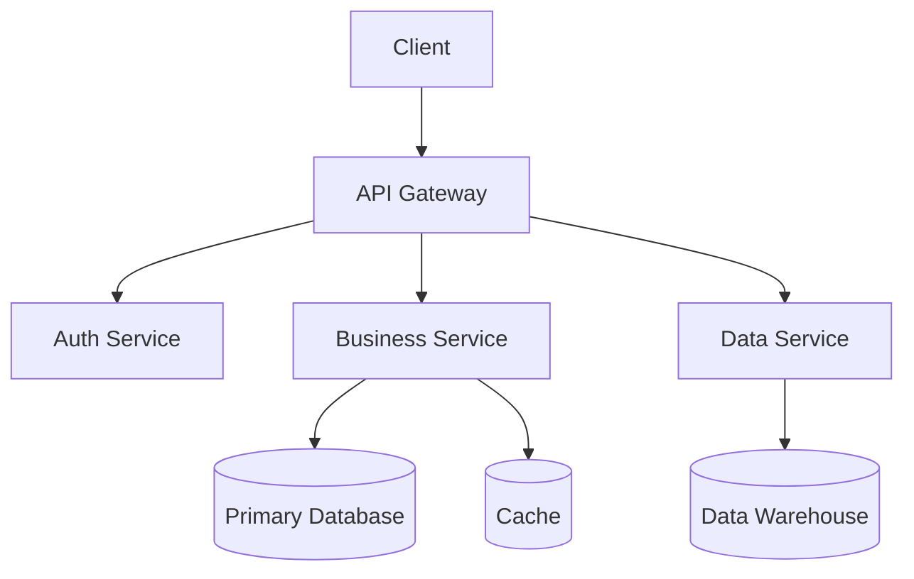

# Product Overview

## Product Positioning

YaYu Product is a comprehensive enterprise solution designed to help businesses improve efficiency, reduce costs, and optimize business processes.

## Core Architecture

Our product adopts a modern microservices architecture to ensure high availability and scalability:

## Core Modules

### 1. User Management Module

- User registration and authentication
- Role and permission management
- Single Sign-On (SSO)
- Multi-Factor Authentication (MFA)

### 2. Data Processing Module

- Real-time data processing
- Batch data import/export
- Data cleaning and transformation
- Data analysis and reporting

### 3. Integration Module

- RESTful API
- WebSocket real-time communication
- Third-party system integration
- Webhook event notifications

### 4. Management Console

- Visual dashboard
- System monitoring
- Log management
- Configuration management

## Technology Stack

| Layer | Technology |
|-------|------------|
| Frontend | React, TypeScript, Ant Design |
| Backend | Python, FastAPI, Celery |
| Database | PostgreSQL, Redis |
| Message Queue | RabbitMQ |
| Deployment | Docker, Kubernetes |
| Monitoring | Prometheus, Grafana |

## Performance Metrics

- **Response Time**: < 100ms (P95)
- **Concurrent Processing**: 10,000+ QPS
- **Availability**: 99.9% SLA
- **Data Throughput**: 1TB/day

## Security Features

!!! success "Security Assurance"
    - Data encryption (in transit and at rest)
    - Regular security audits
    - Vulnerability scanning and fixes
    - Compliance certifications (ISO 27001, SOC 2)

## Deployment Options

We support multiple deployment methods:

=== "Cloud Deployment"
    - Alibaba Cloud
    - AWS
    - Azure
    - Google Cloud

=== "On-Premise Deployment"
    - Single server deployment
    - Cluster deployment
    - Containerized deployment

=== "Hybrid Cloud"
    - Core services deployed on-premise
    - Edge services deployed in cloud

## Next Steps

- Learn about detailed [Features](features.md)
- Check [API Documentation](../api/reference.md)

