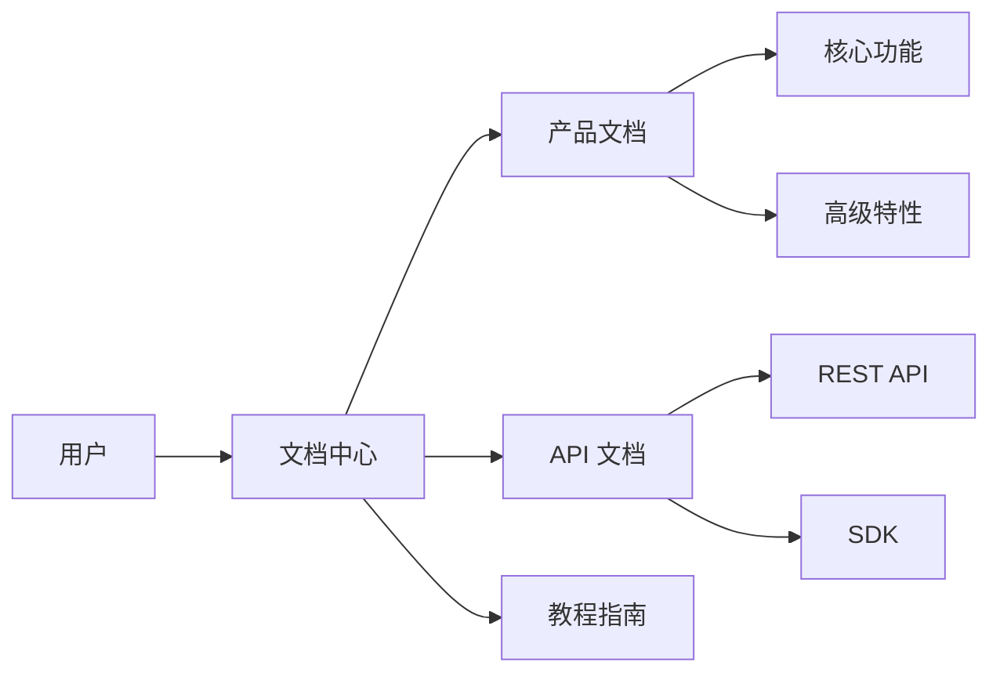

# 产品简介

## 概述

YayuWiki 是一个企业级产品文档中心，为用户提供全面的技术文档、API 参考和最佳实践指南。

## 主要特点

### 1. 全面的文档覆盖

- **产品文档** - 详细的产品功能说明和使用指南
- **API 文档** - 完整的 API 接口文档和示例代码
- **最佳实践** - 经过验证的解决方案和使用技巧

### 2. 多语言支持

我们的文档支持中英文双语，满足不同用户的需求。

### 3. 现代化的阅读体验

- 深色/浅色主题切换
- 响应式设计，完美适配各种设备
- 强大的搜索功能
- 代码高亮和复制

## 产品架构

## 目标用户

- **开发人员** - 需要集成我们产品的技术人员
- **产品经理** - 了解产品功能和规划
- **技术支持** - 解决用户问题的支持团队
- **最终用户** - 使用产品的企业用户

## 下一步

继续阅读 [安装指南](installation.md) 了解如何快速开始使用我们的产品。

