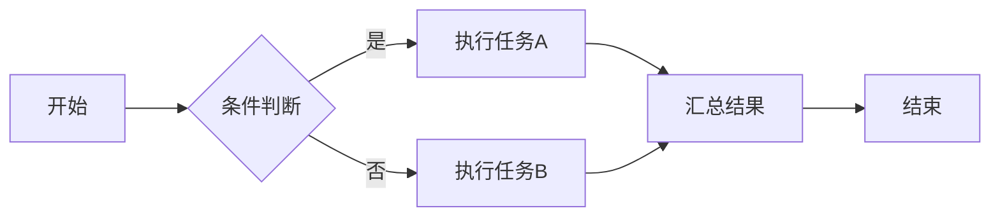

# 功能特性

本页面详细介绍产品的核心功能和特性。

## 核心功能

### 1. 用户认证与授权

#### 多种认证方式

- **用户名密码登录** - 传统的用户名密码认证
- **OAuth 2.0** - 支持第三方登录（微信、钉钉等）
- **LDAP/AD** - 企业目录服务集成
- **SAML 2.0** - 企业级单点登录

#### 权限管理

```python
# 示例：基于角色的权限控制
@require_permission("user:read")
def get_user_list():
    """获取用户列表"""
    return User.query.all()

@require_permission("user:write")
def create_user(user_data):
    """创建用户"""
    user = User(**user_data)
    db.session.add(user)
    db.session.commit()
    return user
```

### 2. 数据管理

#### 数据导入

支持多种格式的数据导入：

- CSV
- Excel (XLSX)
- JSON
- XML

#### 数据导出

```javascript
// 示例：导出数据为 Excel
async function exportToExcel(data, filename) {
    const workbook = new ExcelJS.Workbook();
    const worksheet = workbook.addWorksheet('Data');
    
    // 添加表头
    worksheet.columns = [
        { header: 'ID', key: 'id', width: 10 },
        { header: 'Name', key: 'name', width: 32 },
        { header: 'Email', key: 'email', width: 32 }
    ];
    
    // 添加数据
    worksheet.addRows(data);
    
    // 保存文件
    const buffer = await workbook.xlsx.writeBuffer();
    saveAs(new Blob([buffer]), filename);
}
```

### 3. 实时通信

#### WebSocket 支持

```python
# 服务端示例
from fastapi import WebSocket

@app.websocket("/ws")
async def websocket_endpoint(websocket: WebSocket):
    await websocket.accept()
    while True:
        data = await websocket.receive_text()
        await websocket.send_text(f"Message received: {data}")
```

```javascript
// 客户端示例
const ws = new WebSocket('ws://localhost:8080/ws');

ws.onopen = () => {
    console.log('Connected to server');
    ws.send('Hello Server!');
};

ws.onmessage = (event) => {
    console.log('Received:', event.data);
};
```

### 4. 任务调度

支持定时任务和异步任务处理：

```python
from celery import Celery

app = Celery('tasks', broker='redis://localhost:6379')

@app.task
def process_data(data_id):
    """异步处理数据"""
    data = fetch_data(data_id)
    result = analyze_data(data)
    save_result(result)
    return result

# 定时任务
@app.task
def daily_report():
    """每日报表生成"""
    generate_report()
```

### 5. 监控与告警

#### 系统监控

- CPU 使用率
- 内存使用情况
- 磁盘 I/O
- 网络流量

#### 业务监控

- API 调用统计
- 错误率监控
- 响应时间分析
- 用户行为追踪

#### 告警规则

!!! warning "告警配置示例"
    ```yaml
    alerts:
      - name: high_cpu_usage
        condition: cpu_usage > 80%
        duration: 5m
        severity: warning
        notification:
          - email
          - slack
      
      - name: api_error_rate
        condition: error_rate > 5%
        duration: 3m
        severity: critical
        notification:
          - email
          - sms
          - pagerduty
    ```

## 高级特性

### 1. 插件系统

支持通过插件扩展功能：

```python
class Plugin:
    """插件基类"""
    
    def __init__(self, config):
        self.config = config
    
    def on_load(self):
        """插件加载时调用"""
        pass
    
    def on_request(self, request):
        """请求处理时调用"""
        pass
    
    def on_response(self, response):
        """响应返回时调用"""
        pass
```

### 2. 工作流引擎

可视化的工作流设计和执行：



### 3. 数据分析

内置强大的数据分析功能：

- 统计分析
- 趋势预测
- 异常检测
- 关联分析

## 性能优化

### 缓存策略

```python
from functools import lru_cache
from redis import Redis

redis_client = Redis(host='localhost', port=6379)

# 内存缓存
@lru_cache(maxsize=1000)
def get_user_by_id(user_id):
    return User.query.get(user_id)

# Redis 缓存
def get_product(product_id):
    cache_key = f"product:{product_id}"
    cached = redis_client.get(cache_key)
    
    if cached:
        return json.loads(cached)
    
    product = Product.query.get(product_id)
    redis_client.setex(
        cache_key, 
        3600,  # 1小时过期
        json.dumps(product.to_dict())
    )
    return product.to_dict()
```

### 数据库优化

- 索引优化
- 查询优化
- 连接池管理
- 读写分离

## 扩展性

产品支持水平扩展和垂直扩展：

| 扩展方式 | 说明 | 适用场景 |
|---------|------|---------|
| 水平扩展 | 增加服务器节点 | 高并发访问 |
| 垂直扩展 | 提升单机配置 | 计算密集型任务 |
| 微服务拆分 | 服务解耦 | 复杂业务场景 |

## 下一步

- 查看 [API 文档](../api/reference.md) 了解接口详情
- 阅读 [安装指南](../getting-started/installation.md) 开始使用

