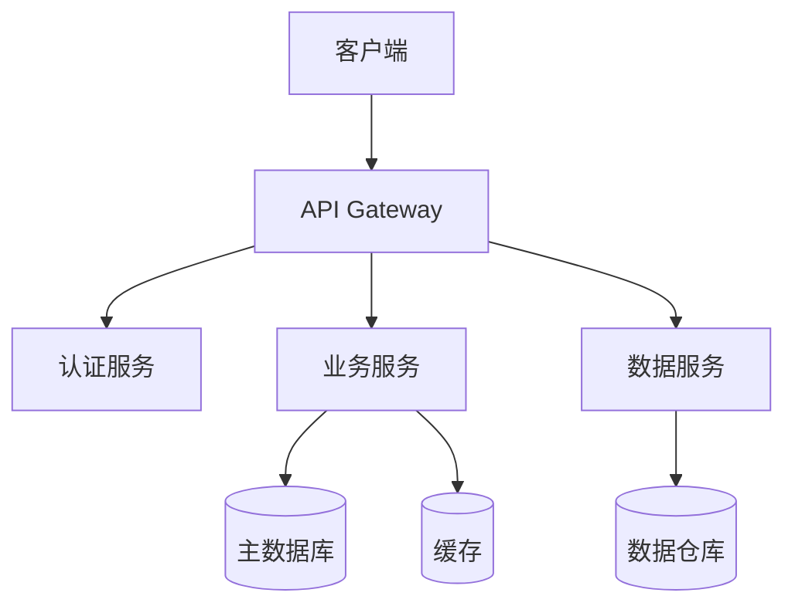

# 产品概述

## 产品定位

YaYu 产品是一个面向企业的综合性解决方案，旨在帮助企业提升效率、降低成本、优化业务流程。

## 核心架构

我们的产品采用现代化的微服务架构，确保高可用性和可扩展性：

## 核心模块

### 1. 用户管理模块

- 用户注册与认证
- 角色权限管理
- 单点登录 (SSO)
- 多因素认证 (MFA)

### 2. 数据处理模块

- 实时数据处理
- 批量数据导入导出
- 数据清洗和转换
- 数据分析和报表

### 3. 集成模块

- RESTful API
- WebSocket 实时通信
- 第三方系统集成
- Webhook 事件通知

### 4. 管理控制台

- 可视化仪表板
- 系统监控
- 日志管理
- 配置管理

## 技术栈

| 层级 | 技术 |
|------|------|
| 前端 | React, TypeScript, Ant Design |
| 后端 | Python, FastAPI, Celery |
| 数据库 | PostgreSQL, Redis |
| 消息队列 | RabbitMQ |
| 部署 | Docker, Kubernetes |
| 监控 | Prometheus, Grafana |

## 性能指标

- **响应时间**: < 100ms (P95)
- **并发处理**: 10,000+ QPS
- **可用性**: 99.9% SLA
- **数据吞吐**: 1TB/天

## 安全特性

!!! success "安全保障"
    - 数据加密（传输和存储）
    - 定期安全审计
    - 漏洞扫描和修复
    - 合规认证（ISO 27001, SOC 2）

## 部署方式

我们支持多种部署方式：

=== "云部署"
    - 阿里云
    - AWS
    - Azure
    - Google Cloud

=== "本地部署"
    - 单机部署
    - 集群部署
    - 容器化部署

=== "混合云"
    - 核心服务本地部署
    - 边缘服务云端部署

## 下一步

- 了解详细的 [功能特性](features.md)
- 查看 [API 文档](../api/reference.md)

